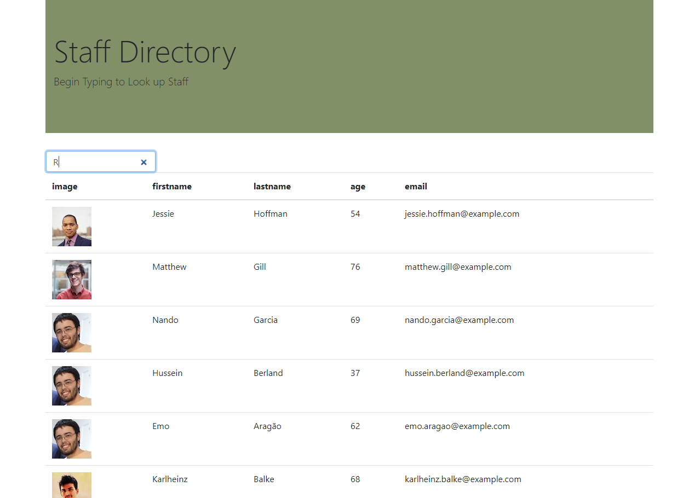

# Staff Directory

### A simple app to help you sort through your employees by name

## Table of Contents
* [Technologies Used](Technologies_Used)
* [Deployed Site](Deployed)
* [Features](Features)
* [Usage](Usage)
* [Author](Author)
* [Credits](Credits)
* [License](License)

## Technologies_Used
* HTML 
* CSS
* React js
* github pages

## Deployed Site
[ClickClick!]( https://rksouth.github.io/Clicker-Game/)

## Features 

__1. A Table of Employees__
 
In order to get a table of employees I first had to call the employees with an axios call. In order to get the promise structure correct and to get it write everything out I had to use componentdidMount that looped through the and then follow it up with setStcate.

Then this is followed up later by a render table which calls out the previously named stuff and puts it in a neat little table.

__2. A search Area__

In order to search an area I built a handlesearch function that looks for what is being typed in and compares to the data in the fields.
Then, I wrote -
      <input className="form-control" type="search" placeholder="search"onChange={event => this.handleSearch(event)}/> 
To be called as part of the JSX.

__3. To Be Added Later: A sortable Table__

I was unable to sort my search by ascending/descending or alphabetical order. To be frank, I did a lot of research and found myself unable to commit to one way of doing it. But let me run down the top options:

1. I found a great article on column sorting, [Link](https://adazzle.github.io/react-data-grid/docs/examples/column-sorting) which seems to take the work out of it for you. It has a long column and basically shows how to feed the data in and get every single column to sort at the same time. Seems like a no-brainer but, I got a little stuck on how to make the classes/functions work together (as classes are my biggest nemesis in coding). I tried 3 ways different and swiftly went back to original code.

2. Write sort function - I do have a fantastic sort function but -it feels like it's missing something. not quite sure but when I try to use it the same way I made the search function work it falls apart. I left it in, because in the same way that classes are something I have to befriend, functions are  old friends. I tried building my sorts out in a special data land but like the search functions they seemed to migrate. 

## Usage
### How do you use this project? This is meant for anyone looking for a more structured approach to exercise and working out. If you are looking to keep an easy to manage website 
 
## Author 
Rachael Kelm-Southworth

* [linkedin](https://www.linkedin.com/in/rachael-kelm-southworth-87a3831b3) 

* [Portfolio](https://rksouth.github.io/Portfolio/ )

* [github](https://github.com/RKSouth/)

 ## Credits

I would like to thank Kerwin, Manuel, Roger, Jerome and all my classmates for helping me understand this subject matter and anyone that contributed to make the base code.

## License
[MIT](https://choosealicense.com/licenses/mit/)

